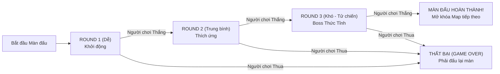

# Thiết Kế Hệ Thống Cơ Chế Chiến Đấu Nâng Cao (Combat Mechanics)

Tài liệu này định nghĩa các luật chơi và cơ chế chiến đấu có chiều sâu chiến thuật, ngăn chặn tình trạng người chơi chỉ nhấp một nút duy nhất để thắng (button mashing).

---

## 1. Thanh Nội Năng / Năng Lượng (Energy / Mana Gauge)

Bên cạnh thanh máu (HP Bar), mỗi nhân vật cần có thêm một **thanh Năng Lượng (Mana Bar)** màu xanh lam ngọc nằm ngay bên dưới thanh máu trong `HudComponent`:
* **Quy tắc tích lũy (Gain)**:
  - Tung đòn đánh thường trúng đích: `+10 Mana`.
  - Bị đối thủ đánh trúng: `+5 Mana`.
  - Tự động hồi chậm theo thời gian: `+2 Mana / giây`.
  - Mức tối đa: `100 Mana`.
* **Tiêu hao năng lượng (Cost)**:
  - `ATK 1` (Đòn đánh nhẹ): Tiêu hao `0 Mana`.
  - `ATK 2` (Đòn đánh vừa): Tiêu hao `0 Mana`.
  - `ATK 3` (Đòn hạng nặng / Phun lửa / Quét kiếm): Tiêu hao `25 Mana`.
  - `ULT` (Tuyệt kỹ / Cầu lửa khổng lồ): Tiêu hao `50 Mana`.
* **Tác dụng**: Buộc người chơi phải đánh thường tích lũy năng lượng trước khi có thể xả chiêu thức lớn, tạo nhịp độ công - thủ rõ ràng.

---

## 2. Hệ Thống Chuỗi Chiêu (Chain Combo System)

Các đòn đánh được thiết kế để có thể hủy bỏ thời gian hồi (Animation Canceling) nếu bấm đúng nhịp:
```text
[ATK 1: Đòn nhẹ]  ──(Bấm nhịp nhàng)──>  [ATK 2: Đòn vừa]  ──(Bấm nhịp nhàng)──>  [ATK 3: Đòn nặng]  ──(Hủy chiêu)──>  [ULT: Tuyệt chiêu]
```
* **Quy tắc**:
  - Nếu đánh trúng đối thủ ở đòn 1, người chơi có cửa sổ `0.2s` để bấm đòn 2.
  - Nếu kết nối đủ 3 đòn liên tiếp, đối thủ sẽ bị rơi vào trạng thái **Choáng nhẹ (Hit-Stun)**, không thể phản xạ trong tích tắc, tạo cơ hội tung chiêu cuối kết liễu.
  - Hiển thị dòng chữ đếm combo trên màn hình: `2 HITS!`, `3 HITS!`, `COMBO FINISH!` bằng chữ pixel vàng.

---

## 3. Cơ Chế Thủ Thế & Đỡ Đòn (Block / Guard)

* **Cách thực hiện**:
  - Khi người chơi giữ nút lùi (quay lưng lại với đối thủ) trong lúc đối thủ đang ra đòn:
    - Nhân vật chuyển sang tư thế phòng thủ.
    - **Sát thương nhận vào giảm 80%**.
    - Nhân vật không bị ngã hay gián đoạn hoạt ảnh, chỉ bị đẩy lùi nhẹ một đoạn ngắn.
  - **Cơ chế Phá Giáp (Guard Crush)**:
    - Nếu đỡ đòn liên tục quá 4 lần, thanh phòng thủ sẽ vỡ (Guard Break), nhân vật bị choáng trong 1.2s.

---

## 4. Bảng Cân Bằng Đặc Trưng 5 Nhóm Nhân Vật (Roster Archetypes)

Dự án có 12 nhân vật, có thể phân thành 5 trường phái võ thuật rõ rệt:

| Nhóm Nhân Vật | Nhân Vật Tiêu Biểu | Ưu Điểm | Nhược Điểm | Chiến Thuật Khuyên Dùng |
| :--- | :--- | :--- | :--- | :--- |
| **Pháp Sư (Mage)** | Fire Wizard, Lightning Mage, Wanderer | Tầm đánh xa, sát thương kỹ năng cực lớn | Máu mỏng, tốc độ đánh thường chậm | Thả diều (kite), đứng từ xa bắn cầu lửa và phun lửa |
| **Đấu Sĩ Giáp (Knight)** | Knight 1, Knight 2, Knight 3 | Máu dày, giáp cao, lực chém nặng | Tốc độ di chuyển chậm, không có đạn tầm xa | Áp sát, đè ép góc đài, dùng khiên chống đỡ rồi phản công |
| **Sát Thủ (Samurai)** | Samurai, Samurai Commander | Tốc độ lướt cực nhanh, combo mượt mà | Tầm đánh trung bình, lượng máu vừa phải | Tận dụng chạy bứt tốc (`Run`), luồn ra sau lưng đối thủ rồi combo |
| **Xạ Thủ (Archer)** | Samurai Archer, Skeleton Archer | Tầm đánh xa nhất game, bắn tên liên tục | Rất yếu khi bị kẻ địch áp sát cận chiến | Nhảy lùi, giữ khoảng cách tối đa với đối thủ |
| **Giáo Sĩ (Spearman)** | Skeleton Spearman | Đòn đâm tầm trung xa hơn kiếm sĩ | Đòn đánh theo đường thẳng hẹp | Căn đúng khoảng cách đầu mũi giáo để đánh trúng ngoài tầm kiếm đối phương |

---

## 5. Hệ Thống Thử Thách 3 Hiệp Đấu Bắt Buộc (Must-Win 3 Rounds Gauntlet)

Để vượt qua bất kỳ màn đấu nào (Stage / Map), người chơi **bắt buộc phải giành chiến thắng trọn vẹn cả 3 Round đấu liên tiếp (Round 1, Round 2, Round 3)** trước đối thủ:



### A. Giao diện Chỉ Báo 3 Hiệp Đấu (Gauntlet Round Badges)
- Dưới thanh máu người chơi và đối thủ hiển thị **3 huy hiệu ngọc chiến công (3 Round Badges)**:
  - `Trạng thái chưa đấu`: Ngọc xám mờ viền đồng thau.
  - `Chiến thắng round`: Ngọc bừng sáng rực rỡ màu vàng kim (cho P1) hoặc đỏ thẫm (cho CPU).
  - **Điều kiện Clear Map**: Người chơi phải thắp sáng đủ **cả 3 ngọc vàng (3/3 Wins)** mới được tính là vượt qua màn đấu.
- Hiển thị banner chữ nổi bật:
  - Hiệp 1: **`ROUND 1`** $\rightarrow$ **`FIGHT!`** (Khởi động)
  - Hiệp 2: **`ROUND 2`** $\rightarrow$ **`FIGHT!`** (Cảnh giác)
  - Hiệp 3: **`FINAL ROUND - SUDDEN DEATH`** $\rightarrow$ **`FIGHT!`** (Tử chiến sinh tử)

### B. Quy tắc Chuyển Đổi & Hồi Phục Qua 3 Hiệp
1. **Khi người chơi thắng 1 Round**:
   - Đối thủ ngã gục (`Dead` animation 1.2s), màn hình lóe sáng chữ **`ROUND CLEARED`**.
   - Thắp sáng thêm 1 viên ngọc chiến thắng cho người chơi.
   - **Tái lập võ đài (1.5s)**:
     - Hai nhân vật trở về vị trí xuất phát.
     - Người chơi được hồi đầy `100% HP`.
     - **Tích lũy khí thế**: Năng lượng (Mana) được bảo lưu `50%` từ hiệp trước, cho phép người chơi tung chiêu mạnh sớm ở đầu round sau.
     - Đối thủ bước vào Round kế tiếp với **trạng thái bùng nổ, độ khó và trí thông minh tăng vọt**.
2. **Khi người chơi bị đối thủ hạ gục ở bất kỳ Round nào**:
   - Trận đấu lập tức kết thúc với màn hình **`DEFEAT / GAME OVER`**.
   - Người chơi có 2 lựa chọn:
     - `RETRY ROUND`: Dùng 1 lượt hồi sinh (hoặc xem quảng cáo) để đấu lại round đó.
     - `RESTART STAGE`: Bắt đầu lại từ Round 1 của Map đó.
3. **Xử lý Hết giờ (Time Over - 60s/99s)**:
   - Nếu hết giờ: Bên nào có % máu cao hơn sẽ được xử Thắng. Nếu người chơi ít máu hơn hoặc bằng máu (Double K.O), người chơi sẽ bị xử thua để đảm bảo tính thử thách khắt khe.

---

## 6. Ma Trận Nâng Độ Khó Đa Chiều: Tăng Theo Từng Map (1 -> 7) & Từng Round (1 -> 3)

Độ khó của trò chơi không cố định mà được tính toán theo công thức lũy tiến 2 chiều:
$$\mathbf{Chỉ\ Số\ Độ\ Khó\ Tổng} = \mathbf{Hệ\ Số\ Cấp\ Map\ (1..7)} \times \mathbf{Hệ\ Số\ Cấp\ Round\ (1..3)}$$

### A. Tiến Trình 7 Màn Đấu (7 Stages Roadmap)

| Màn Đấu (Stage) | Bối Cảnh Bản Đồ | Đẳng Cấp Thử Thách | Hệ Số Máu NPC (HP Multiplier) | Hệ Số Sát Thương (Damage Multiplier) |
| :--- | :--- | :--- | :--- | :--- |
| **Map 1** | Rừng Xanh Huyền Bí (`bg1.png`) | Tân Binh (Beginner) | `x1.00` (100 HP) | `x1.00` |
| **Map 2** | Thung Lũng Cát Lún (`bg2.png`) | Tập Sự (Apprentice) | `x1.15` (115 HP) | `x1.10` |
| **Map 3** | Rừng Ma Ám Sương Mù (`bg3.png`) | Chiến Binh (Warrior) | `x1.30` (130 HP) | `x1.20` |
| **Map 4** | Tàn Tích Cổ Thạch (`bg4.png`) | Kỳ Cựu (Veteran) | `x1.50` (150 HP) | `x1.30` |
| **Map 5** | Thác Nước Long Ẩn (`bg5.png`) | Tinh Anh (Elite) | `x1.75` (175 HP) | `x1.40` |
| **Map 6** | Huyết Điện Cấm Kỵ (`bg6.png`) | Bậc Thầy (Master) | `x2.00` (200 HP) | `x1.55` |
| **Map 7** | Hư Không Hắc Ám (`bg7.png`) | Ác Mộng (Nightmare Boss) | `x2.50` (250 HP) | `x1.75` |

---

### B. Bảng Hành Vi NPC AI Qua 3 Round Trong Cùng Một Map

| Tiêu Chí Hành Vi AI | Round 1 (Dễ - Khởi động) | Round 2 (Trung bình - Thích ứng) | Round 3 (Khó - Thức tỉnh / Tử chiến) |
| :--- | :--- | :--- | :--- |
| **Độ trễ suy nghĩ (Think Delay)** | Chậm (`1.0s - 1.4s`) | Vừa (`0.5s - 0.75s`) | Chớp nhoáng (`0.15s - 0.3s`) |
| **Tỷ lệ Đỡ Đòn (Block Guard)** | **`0%`** (Không bao giờ đỡ) | **`35%`** (Biết lùi lại đỡ khi bị dồn) | **`75%`** (Đỡ đòn chuẩn xác, phản công ngay) |
| **Tỷ lệ Nối Chuỗi Combo** | **`0%`** (Chỉ đánh từng chiêu rời) | **`45%`** (Nối `ATK 1 -> ATK 2`) | **`85%`** (Chuỗi liên hoàn `ATK 1 -> 2 -> 3 -> ULT`) |
| **Tỷ lệ Dùng Tuyệt Kỹ (Special / ULT)** | **`10%`** (Hiếm khi dùng) | **`40%`** (Dùng khi đủ cự ly) | **`80%`** (Xả ULT liên tục trừng phạt sơ hở) |
| **Nhảy Né & Không Chiến** | `5%` (Hầu như không nhảy) | `25%` (Nhảy áp sát hoặc né đạn) | `55%` (Bậc thầy không chiến, nhảy né cầu lửa) |
| **Bứt Tốc Áp Sát (`Run`)** | Chỉ đi bộ chậm rãi | Bắt đầu biết chạy khi cách xa `200px` | Lập tức bứt tốc `Run` ép sân khi người chơi lùi |
| **Trừng Phạt Đòn Hụt (Whiff Punish)** | Không có | Lao vào khi người chơi đánh trượt | Canh me khung hình sơ hở của người chơi để phản công |

---

### C. Kiến Trúc Bộ Não AI Trong Mã Nguồn (Code Architecture)

Hồ sơ `AiProfile` tự động tính toán phối hợp giữa `mapLevel` (từ 1 đến 7) và `round` (từ 1 đến 3):

```dart
class AiProfile {
  final double minThinkDelay;
  final double maxThinkDelay;
  final double blockChance;     // Tỉ lệ đỡ đòn (0.0 -> 1.0)
  final double comboChance;     // Tỉ lệ nối chuỗi chiêu khi trúng đích
  final double jumpChance;      // Tỉ lệ nhảy né chiêu / không chiến
  final double specialChance;   // Tỉ lệ dùng chiêu 3 và ULT
  final double runThreshold;    // Khoảng cách kích hoạt chạy bứt tốc
  final double hpMultiplier;    // Nhân máu đối thủ theo cấp map
  final double damageMultiplier;// Nhân sát thương theo cấp map

  const AiProfile({
    required this.minThinkDelay,
    required this.maxThinkDelay,
    required this.blockChance,
    required this.comboChance,
    required this.jumpChance,
    required this.specialChance,
    required this.runThreshold,
    required this.hpMultiplier,
    required this.damageMultiplier,
  });

  /// Tạo cấu hình AI leo thang kết hợp giữa Map (1..7) và Round (1..3)
  factory AiProfile.forMapAndRound(int mapLevel, int round) {
    // 1. Hệ số nền tảng của từng Map (1..7)
    final mapIndex = (mapLevel - 1).clamp(0, 6);
    final baseHpMult = 1.0 + (mapIndex * 0.25);       // Map 1: 1.0x -> Map 7: 2.5x HP
    final baseDmgMult = 1.0 + (mapIndex * 0.125);     // Map 1: 1.0x -> Map 7: 1.75x Dmg
    final mapSpeedBoost = mapIndex * 0.08;             // Càng map sau phản xạ càng nhanh

    // 2. Hệ số leo thang qua 3 Round trong Map đó
    return switch (round) {
      1 => AiProfile(
        minThinkDelay: (1.2 - mapSpeedBoost).clamp(0.4, 1.4),
        maxThinkDelay: (1.5 - mapSpeedBoost).clamp(0.6, 1.8),
        blockChance: (0.0 + mapIndex * 0.05).clamp(0.0, 0.35),
        comboChance: 0.10,
        jumpChance: 0.08,
        specialChance: 0.15,
        runThreshold: 240,
        hpMultiplier: baseHpMult,
        damageMultiplier: baseDmgMult,
      ),
      2 => AiProfile(
        minThinkDelay: (0.6 - mapSpeedBoost * 0.5).clamp(0.25, 0.8),
        maxThinkDelay: (0.85 - mapSpeedBoost * 0.5).clamp(0.4, 1.0),
        blockChance: (0.35 + mapIndex * 0.06).clamp(0.35, 0.65),
        comboChance: 0.45,
        jumpChance: 0.25,
        specialChance: 0.45,
        runThreshold: 190,
        hpMultiplier: baseHpMult * 1.05,
        damageMultiplier: baseDmgMult * 1.05,
      ),
      _ => AiProfile( // Round 3: Thử thách cực hạn / Boss Thức Tỉnh
        minThinkDelay: (0.22 - mapSpeedBoost * 0.3).clamp(0.12, 0.35),
        maxThinkDelay: (0.38 - mapSpeedBoost * 0.3).clamp(0.20, 0.55),
        blockChance: (0.70 + mapIndex * 0.04).clamp(0.70, 0.90),
        comboChance: 0.85,
        jumpChance: 0.50,
        specialChance: 0.80,
        runThreshold: 150,
        hpMultiplier: baseHpMult * 1.15,
        damageMultiplier: baseDmgMult * 1.15,
      ),
    };
  }
}
```

---

### D. Cài Đặt Logic AI Trong CharacterComponent (`_handleAI`)

```dart
  void _handleAI(double dt, AiProfile ai) {
    if (_isAttacking || _isHurt || _isLanding || isDead) return;
    if (opponent == null || opponent!.isDead) {
      _velocityX = 0;
      _switchState(CharacterState.idle);
      return;
    }

    _aiTimer -= dt;
    final dx = opponent!.position.x - position.x;
    final dist = dx.abs();
    final opponentIsAttacking = opponent!._isAttacking;
    final atkReach = stats.getAttackReach(CharacterState.attack1);

    // 1. Phản xạ Phòng Thủ (Block Behavior):
    if (opponentIsAttacking && dist <= atkReach + 30 && _rng.nextDouble() < ai.blockChance) {
      _velocityX = (dx > 0 ? -1 : 1) * stats.walkSpeed * 80;
      facingRight = dx > 0;
      return;
    }

    // 2. Phản xạ Nhảy né đạn / Áp sát trên không:
    if (_onGround && _rng.nextDouble() < ai.jumpChance * dt) {
      if (opponentIsAttacking || opponent!.position.y < position.y - 20) {
        _velocityY = -stats.jumpPower * 0.95;
        _onGround = false;
        _switchState(CharacterState.jump);
        return;
      }
    }

    // 3. Di Chuyển Định Vị (Spacing & Approach):
    if (dist > ai.runThreshold) {
      _velocityX = (dx > 0 ? 1 : -1) * stats.runSpeed * 100;
      facingRight = dx > 0;
      if (_onGround) _switchState(CharacterState.run);
    } else if (dist > atkReach) {
      _velocityX = (dx > 0 ? 1 : -1) * stats.walkSpeed * 100;
      facingRight = dx > 0;
      if (_onGround) _switchState(CharacterState.walk);
    } else {
      // 4. Ra Đòn & Nối Chuỗi Combo Dựa Trên Cấp Độ AI:
      _velocityX = 0;
      if (_onGround) {
        if (_aiTimer <= 0) {
          _aiTimer = ai.minThinkDelay + _rng.nextDouble() * (ai.maxThinkDelay - ai.minThinkDelay);

          final randSkill = _rng.nextDouble();
          if (randSkill < 0.35) {
            _startAttack(CharacterState.attack1);
          } else if (randSkill < 0.65) {
            _startAttack(CharacterState.attack2);
          } else if (randSkill < 0.65 + ai.specialChance * 0.20) {
            _startAttack(CharacterState.attack3);
          } else {
            _startAttack(CharacterState.special); // ULT bùng nổ
          }
        } else {
          _switchState(CharacterState.idle);
        }
      }
    }
    facingRight = dx > 0;
  }
```

---

### C. Trải Nghiệm Của Người Chơi Qua 3 Hiệp Đấu

1. **Hiệp 1 (Tự tin)**: Người chơi dễ dàng làm quen với nút bấm, dồn ép máy và giành chiến thắng giòn giã.
2. **Hiệp 2 (Cảnh giác)**: Máy bắt đầu biết chạy áp sát, né tránh và đánh trả các đòn đánh nặng khiến người chơi mất máu đáng kể nếu sơ hở.
3. **Hiệp 3 (Nghẹt thở)**: Nếu hòa 1-1, hiệp cuối là một cuộc đấu trí thực sự. Máy biết bắt bài đòn đánh trượt, biết dùng chiêu cuối hủy diệt và buộc người chơi phải vận dụng triệt để cơ chế nhảy, đỡ đòn và nối chuỗi combo để giành chiến thắng.
