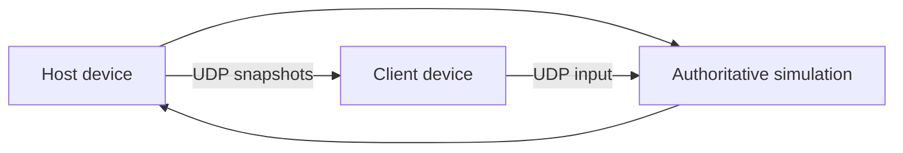

# Kế Hoạch Triển Khai P vs P Qua LAN

## 1. Mục tiêu và quyết định kiến trúc

Mục tiêu là triển khai chế độ đấu 1v1 giữa hai thiết bị trong cùng mạng LAN, ưu tiên cảm giác điều khiển tức thời và khả năng giữ hai máy đồng bộ.

### Quyết định chính

> **UDP cho đường dữ liệu realtime; TCP chỉ cho lobby và sự kiện điều khiển.**

Không gửi input chiến đấu qua TCP. TCP có cơ chế truyền lại và giữ thứ tự, nhưng một packet cũ bị mất có thể làm các packet mới phải chờ, tạo cảm giác khựng. UDP cho phép bỏ qua packet cũ và dùng packet mới nhất, phù hợp với vị trí và input trong game đối kháng.

| Kênh          | Mục đích                                                            | Tần suất / đặc tính                       |
| ------------- | ------------------------------------------------------------------- | ----------------------------------------- |
| TCP           | Tạo phòng, join, chọn tướng, chọn map, ready, bắt đầu/kết thúc trận | Sự kiện ít, cần tin cậy                   |
| UDP           | Input, snapshot, heartbeat, ping, correction                        | 30-60 packet/giây, bỏ packet cũ           |
| UDP broadcast | Tìm phòng trong LAN                                                 | Chỉ dùng ở lobby, không dùng trong combat |

Kiến trúc trận đấu là **host-authoritative**:



Host là nguồn sự thật cho collision, damage, HP, timer, round và kết quả trận đấu. Client được phép dự đoán chuyển động của nhân vật cục bộ để giảm input-to-display latency, sau đó sửa theo snapshot của Host.

## 2. Phạm vi phiên bản đầu

### Bao gồm

- Hai người chơi, một Host và một Client.
- Hai thiết bị cùng Wi-Fi hoặc cùng hotspot.
- Chọn nhân vật và map trước trận.
- Một trận 3 round theo luật hiện tại.
- Đồng bộ di chuyển, nhảy, attack 1/2/3, special, facing, HP và trạng thái chết.
- Tự phát hiện mất kết nối và hiển thị kết quả rõ ràng.

### Chưa bao gồm

- Matchmaking Internet.
- NAT traversal.
- Dedicated server.
- Spectator.
- Wi-Fi Direct trong phiên bản đầu.
- Rollback netcode đầy đủ.

Wi-Fi Direct có thể bổ sung sau, nhưng sẽ kéo theo native permission và khác biệt nền tảng. Socket LAN chuẩn giúp kiểm chứng gameplay networking nhanh hơn và chạy được trên Android, Windows, Linux và macOS với cùng protocol.

## 3. Điều chỉnh kiến trúc game hiện tại

Hiện tại `FightingGame` tạo một `enemy` có AI và `CharacterComponent` vừa giữ input, physics, combat vừa render. Cần tách nguồn dữ liệu mô phỏng khỏi component hiển thị.

### Lớp mới cần có

```text
lib/
├── enums/
│   └── game_mode.dart                 # thêm lanVersus
├── models/network/
│   ├── player_input.dart
│   ├── player_snapshot.dart
│   ├── match_snapshot.dart
│   └── network_packet.dart
├── services/network/
│   ├── lan_discovery_service.dart     # UDP broadcast lobby
│   ├── tcp_control_service.dart       # lobby/control plane
│   ├── udp_realtime_service.dart      # input/snapshot plane
│   └── network_match_session.dart     # lifecycle, sequence, timeout
├── game/simulation/
│   ├── match_simulation.dart           # luật authoritative
│   ├── simulation_state.dart
│   └── input_buffer.dart
└── screens/
    └── lan_versus_screen.dart
```

### Refactor bắt buộc

1. Tạo `PlayerInput` thay cho việc truyền trực tiếp các cờ `movingLeft`, `wantsAttack1`, `wantsSpecial` vào nhân vật remote.
2. Tách `_handleAI()` khỏi đường chạy P vs P; AI chỉ được dùng ở Arcade/Quick Versus.
3. Tạo một simulation state có thể serialize, gồm vị trí, vận tốc, HP, state, facing và tick.
4. Cho `CharacterComponent` nhận state/input từ simulation thay vì tự quyết định kết quả combat trong LAN mode.
5. Giữ VFX cục bộ: hit spark, screen shake, hit-stop và âm thanh không cần truyền mỗi frame.
6. Chỉ truyền event gameplay có ảnh hưởng kết quả, chẳng hạn `damage_confirmed`, qua snapshot hoặc event packet có sequence.

## 4. Giao thức và tần số cập nhật

### TCP control protocol

Mỗi message TCP phải có framing, không giả định một lần `read` tương ứng với một message. Có thể dùng length-prefix:

```text
[uint32 payloadLength][UTF-8 JSON hoặc binary payload]
```

Các message tối thiểu:

```text
hello -> hello_ack -> room_config -> player_ready
       -> match_start -> round_start
       -> round_end -> match_result
       -> disconnect / reconnect
```

TCP chỉ xử lý state machine của session; không chặn game loop chờ TCP.

### UDP input packet

Input nên là bit flags nhỏ, không gửi JSON trong vòng lặp combat khi đã tối ưu:

```text
protocolVersion | sessionId | playerId | sequence | clientTick | inputFlags
```

`inputFlags` gồm trái, phải, chạy, nhảy, attack1, attack2, attack3, special và block nếu cơ chế block đã được triển khai.

Gửi input ở 30 hoặc 60 Hz. Với LAN, bắt đầu bằng 60 Hz nếu packet nhỏ; nếu đo được CPU/network overhead không cần thiết thì dùng 30 Hz và giữ input cuối cùng cho đến packet kế tiếp.

### UDP snapshot packet

Host gửi snapshot ở 20-30 Hz, hoặc 60 Hz nếu chuyển động hiện rõ sai lệch ở 30 Hz. Snapshot có:

- `serverTick`, `ackInputSequence`.
- State của cả hai người chơi.
- HP, timer, round và trạng thái trận.
- Projectile hoặc object gameplay đang tồn tại.
- Event sequence cho hit/damage/death khi cần.

Packet cũ hơn `lastReceivedSequence` phải bỏ qua. Không retransmit snapshot cũ; snapshot mới đã chứa state thay thế.

## 5. Vòng lặp mô phỏng độ trễ thấp

### Host

- Simulation tick cố định: **60 Hz**.
- Nhận input UDP và đưa vào buffer theo sequence.
- Mỗi tick chỉ dùng input mới nhất hợp lệ của từng player.
- Tính physics, collision, damage và round.
- Gửi snapshot định kỳ.

Không dùng `dt` biến thiên trực tiếp cho luật combat network. Render có thể chạy theo frame rate thiết bị, nhưng simulation cần tick cố định để kết quả ổn định hơn.

### Client

- Gửi input ngay khi thay đổi và theo heartbeat 30-60 Hz.
- Dự đoán chuyển động của nhân vật local ngay trên client.
- Hiển thị nhân vật remote bằng interpolation giữa hai snapshot gần nhất.
- Khi nhận snapshot, dùng `ackInputSequence` để loại input đã xác nhận.
- Replay các input local chưa được xác nhận từ state authoritative mới nhất.

Không nên chờ server phản hồi rồi mới hiển thị nút bấm. Đó là yếu tố quan trọng nhất để giữ cảm giác điều khiển trực tiếp.

### Vì sao chưa dùng rollback

Rollback có thể cho cảm giác tốt hơn khi latency cao, nhưng đòi hỏi simulation deterministic, input history, state serialization và rollback toàn bộ combat/VFX. Code hiện tại còn gắn physics, animation và side effect vào `CharacterComponent`, nên host-authoritative + prediction là lộ trình ít rủi ro hơn cho LAN.

## 6. LAN discovery và kết nối

### Host

1. Mở TCP server trên port được chọn từ một khoảng cố định.
2. Mở UDP discovery socket.
3. Mỗi 500-1000 ms phát broadcast chứa tên phòng, protocol version, TCP port và session nonce.
4. Ngừng broadcast ngay sau khi Client join hoặc khi hết thời gian chờ.

### Client

1. Lắng nghe broadcast trong thời gian giới hạn.
2. Hiển thị phòng cùng IP, tên host và ping đo được.
3. Kết nối TCP tới IP/port đã chọn.
4. Xác thực `protocolVersion` và `sessionId`.
5. Chuyển sang UDP realtime sau khi handshake hoàn tất.

Nếu broadcast không hoạt động trên router, cho phép nhập IP thủ công. Đây là fallback bắt buộc để test trong mạng có AP isolation hoặc firewall đặc biệt.

## 7. Xử lý lỗi và an toàn phiên

- Heartbeat UDP mỗi 250 ms.
- Coi peer mất kết nối sau khoảng 2 giây không có heartbeat/input hợp lệ.
- Hiển thị timeout thay vì để nhân vật đứng yên vô hạn.
- Giới hạn packet size và kiểm tra `sessionId`, `playerId`, `sequence`.
- Không tin HP, damage hoặc kết quả trận đấu do Client gửi lên.
- Giới hạn tần suất packet để tránh packet flood làm nghẽn game loop.
- Đóng TCP và UDP socket khi rời màn hình hoặc kết thúc trận.
- Mọi packet parse lỗi phải bị bỏ qua, không làm crash game.

## 8. Kế hoạch thực thi theo phase

### Phase 0 - Baseline

- Ghi lại latency local của input, frame time và tick time ở chế độ offline.
- Tạo `GameMode.lanVersus` nhưng chưa thay đổi gameplay cũ.
- Xác định format state tối thiểu có thể serialize/deserialize.

**Đầu ra:** baseline đo được và test serialize state.

### Phase 1 - Transport proof of concept

- Implement TCP server/client và framing.
- Implement UDP send/receive.
- Implement LAN discovery broadcast.
- Tạo màn hình debug hiển thị ping, packet loss, sequence và disconnect.

**Đầu ra:** hai thiết bị gửi ping/pong ổn định trong cùng Wi-Fi.

### Phase 2 - Lobby

- Thêm `LAN Versus` vào home flow.
- Tạo Host Game và Join Game.
- Đồng bộ chọn tướng, map và ready qua TCP.
- Chỉ cho phép bắt đầu khi protocol/session hợp lệ.

**Đầu ra:** hai máy vào cùng trận với cấu hình giống nhau.

### Phase 3 - Input realtime

- Tạo `PlayerInput` và input buffer.
- Gửi input Client -> Host qua UDP.
- Thay AI của nhân vật thứ hai bằng remote input.
- Đồng bộ tick và sequence.

**Đầu ra:** hai người di chuyển, nhảy và tấn công trên cùng một simulation.

### Phase 4 - Authoritative combat

- Chuyển collision, damage, HP, timer và round result về Host.
- Gửi snapshot Host -> Client.
- Thêm client prediction, reconciliation và remote interpolation.
- Đồng bộ projectile, death và match result.

**Đầu ra:** trận đấu hoàn chỉnh không cần AI và không desync sau nhiều round.

### Phase 5 - Robustness và tối ưu

- Timeout, reconnect hoặc kết thúc trận khi peer rời đi.
- Kiểm tra packet loss nhân tạo 1%, 3%, 5%.
- Kiểm tra jitter và ping 10-100 ms.
- Chuyển packet realtime từ JSON sang `ByteData` nếu profiling cho thấy cần thiết.
- Tối ưu allocation trong loop và đảm bảo socket không chạy trên UI isolate theo cách gây nghẽn.

**Đầu ra:** bản LAN beta có số liệu đo và log chẩn đoán.

## 9. Tiêu chí latency và nghiệm thu

Mục tiêu đo trong cùng Wi-Fi 5 GHz, hai thiết bị thật:

| Chỉ số                         |           Mục tiêu |
| ------------------------------ | -----------------: |
| RTT UDP median                 |           <= 20 ms |
| RTT UDP p95                    |           <= 50 ms |
| Input-to-local-display         | <= 1 frame bổ sung |
| Packet loss thông thường       |               < 1% |
| Simulation tick time           |     < 4 ms ở 60 Hz |
| Thời gian phát hiện disconnect |           <= 2.5 s |
| Desync HP/round sau trận       |                  0 |

Test bắt buộc:

- Hai thiết bị cùng Wi-Fi, cùng hotspot điện thoại.
- Host/client vào phòng rồi thoát giữa round.
- Bấm attack liên tục ở khoảng cách sát nhau.
- Projectile bay khi packet bị mất.
- Jitter tăng đột ngột và packet đến không theo thứ tự.
- Đổi background/map và restart round.
- Chạy 10 trận liên tiếp để phát hiện leak socket hoặc state cũ.

## 10. Dependency và nền tảng

Ưu tiên API chuẩn `dart:io` cho TCP/UDP để giảm dependency và giữ độ trễ thấp. Không cần thêm plugin mạng cho bản LAN Wi-Fi thông thường.

Platform cần kiểm tra:

- Android: quyền `INTERNET`, firewall/hotspot và network policy.
- iOS: khai báo Local Network usage nếu hỗ trợ iOS.
- Windows: Windows Defender Firewall có thể cần cho phép app nhận kết nối.
- Linux/macOS: kiểm tra firewall và interface mạng đang active.

`flutter_p2p_connection` chỉ nên là phương án riêng cho Android Wi-Fi Direct ở phase sau, không phải transport gameplay chính.

## 11. Definition of Done

- [ ] Có thể Host/Join trong cùng LAN.
- [ ] Lobby TCP đồng bộ cấu hình và ready.
- [ ] Combat realtime dùng UDP, không dùng TCP cho input mỗi frame.
- [ ] Host authoritative cho damage, HP, round và kết quả.
- [ ] Client prediction hoạt động cho nhân vật local.
- [ ] Remote player chuyển động mượt bằng interpolation.
- [ ] Packet cũ, mất, trùng và sai session được xử lý.
- [ ] Timeout/disconnect có UI rõ ràng.
- [ ] Có test protocol, test state serialization và integration test hai peer.
- [ ] Đạt các ngưỡng latency ở trên trên thiết bị thật.
